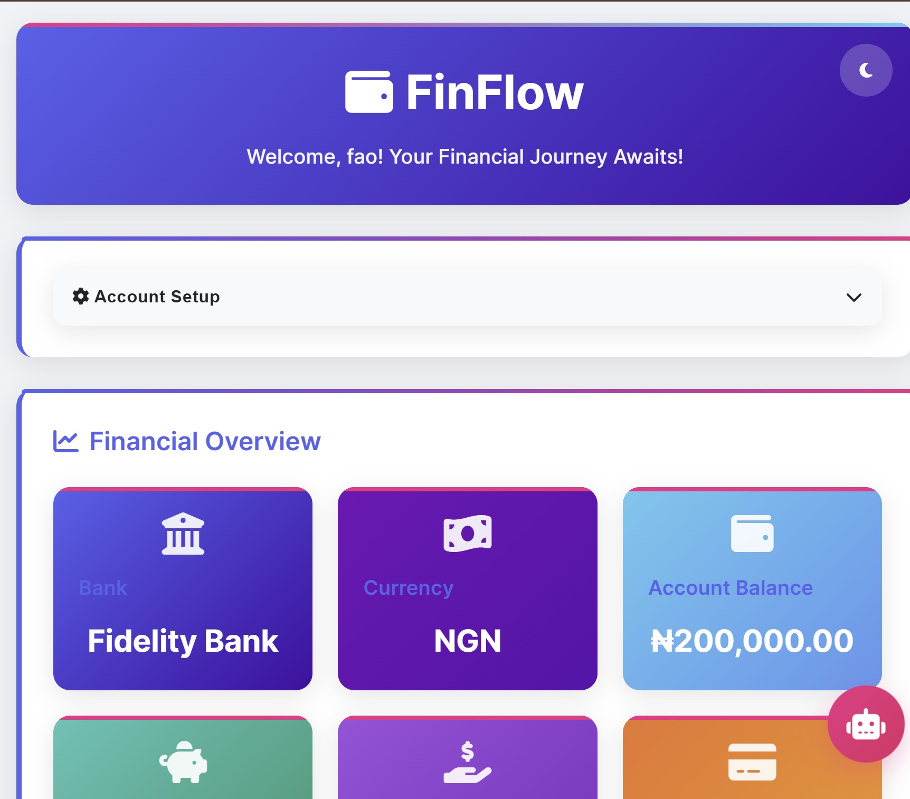
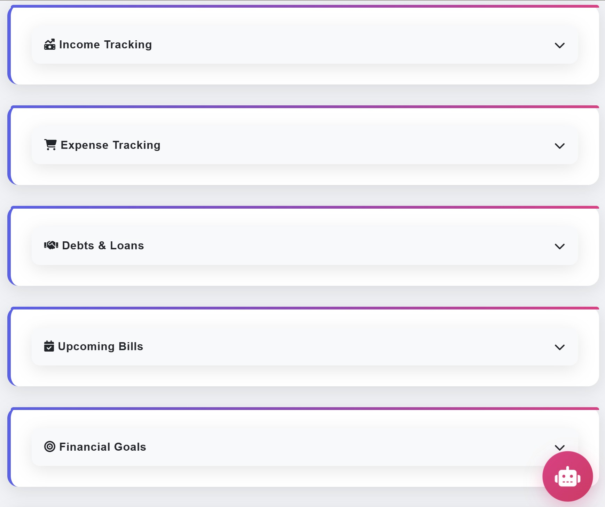
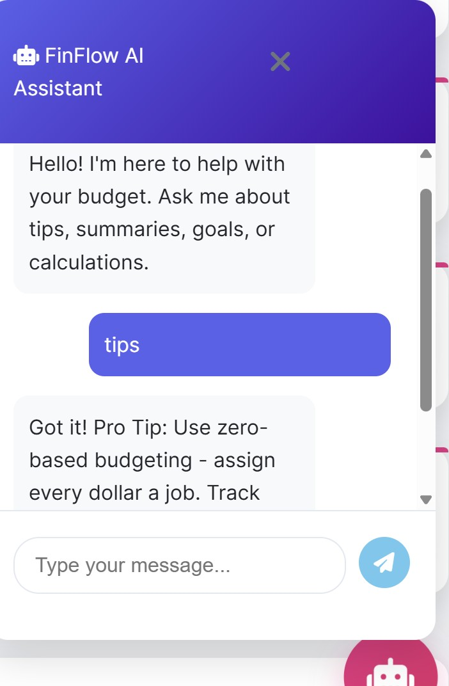

# FinFlow - Smart Budget Planner

FinFlow is a modern, user-friendly web application designed to help you manage your personal finances. Built with HTML, CSS, and JavaScript, it offers features like income and expense tracking, debt management, upcoming bill scheduling, financial goal setting, and monthly reports. The app includes a sleek interface, dark mode, and an AI-powered chatbot for financial guidance.

## Features

- **Account Setup**: Configure your bank, currency, and starting balance.
- **Dashboard**: Visualize key metrics like balance, savings, debts, and net worth.
- **Income & Expense Tracking**: Log and categorize income and expenses with a dynamic pie chart.
- **Debts & Loans**: Track money owed to you or by you.
- **Upcoming Bills**: Schedule and manage future payments.
- **Financial Goals**: Set and monitor savings goals with progress bars.
- **Monthly Reports**: View income, expenses, and net summaries for the current month (September 2025).
- **Transaction History**: Filter and export transaction records.
- **AI Chatbot**: Get tips, summaries, and budget advice.
- **Dark Mode**: Toggle between light and dark themes for better usability.
- **Password Protection**: Secure your data with a simple access code (default: `1234567890`).

## Screenshots

*Dashboard Overview*  


*Monthly Report*  


*Chatbot Interface*  


## Prerequisites

- A modern web browser (Chrome, Firefox, Edge, etc.).
- [Git](https://git-scm.com/) installed for cloning the repository.
- Optional: A local server (e.g., [Live Server](https://marketplace.visualstudio.com/items?itemName=ritwickdey.LiveServer) for VS Code) for development.

## Installation

1. **Clone the Repository**:
   ```bash
   git clone https://github.com/your-username/budget-planner.git
   cd budget-planner# FinFlow - Smart Budget Planner

FinFlow is a modern, user-friendly web application designed to help you manage your personal finances. Built with HTML, CSS, and JavaScript, it offers features like income and expense tracking, debt management, upcoming bill scheduling, financial goal setting, and monthly reports. The app includes a sleek interface, dark mode, and an AI-powered chatbot for financial guidance.

## Features

- **Account Setup**: Configure your bank, currency, and starting balance.
- **Dashboard**: Visualize key metrics like balance, savings, debts, and net worth.
- **Income & Expense Tracking**: Log and categorize income and expenses with a dynamic pie chart.
- **Debts & Loans**: Track money owed to you or by you.
- **Upcoming Bills**: Schedule and manage future payments.
- **Financial Goals**: Set and monitor savings goals with progress bars.
- **Monthly Reports**: View income, expenses, and net summaries for the current month (September 2025).
- **Transaction History**: Filter and export transaction records.
- **AI Chatbot**: Get tips, summaries, and budget advice.
- **Dark Mode**: Toggle between light and dark themes for better usability.
- **Password Protection**: Secure your data with a simple access code (default: `1234567890`).

## Screenshots

*Dashboard Overview*  


*Monthly Report*  


*Chatbot Interface*  


## Prerequisites

- A modern web browser (Chrome, Firefox, Edge, etc.).
- [Git](https://git-scm.com/) installed for cloning the repository.
- Optional: A local server (e.g., [Live Server](https://marketplace.visualstudio.com/items?itemName=ritwickdey.LiveServer) for VS Code) for development.

## Installation

1. **Clone the Repository**:
   ```bash
   git clone https://github.com/your-username/budget-planner.git
   cd budget-planner

 2.  # Open the Application

- **Open index.html** directly in a web browser, or  
- Use a local server for development:
  npx live-server

  
1. Access the App

- Enter the default access code: `1234567890`.
- Set up your account details (name, bank, currency, balance).

## Usage

### Account Setup

- Enter your name, select a bank, choose a currency, and input your starting balance and savings.
- Save to initialize the dashboard.

### Dashboard

- Click cards (e.g., Bank, Net Worth) to view detailed modals.
- Monitor budget utilization with the progress bar.

### Tracking

- Add income (e.g., Salary, $5000) and expenses (e.g., Rent, $1500) with optional categories.
- Schedule upcoming bills (e.g., Internet, $85, due 2025-09-20).
- Track debts (e.g., "John owes me $150") and loans.

### Goals

- Set financial goals (e.g., Emergency Fund, $10,000) and track progress.

### Reports

- View the monthly summary for September 2025, including income, expenses, and net.
- Analyze category breakdowns in the report table.

### History

- Filter transactions by date or export as a `.txt` file.

### Chatbot

- Click the robot icon (bottom-right) to open the AI assistant.
- Ask about income, expenses, goals, or tips (e.g., "What's my net worth?").

# Development

- **Tech Stack**: HTML, CSS, JavaScript, Chart.js for visualizations, Font Awesome for icons.

## File Structure
budget-planner/
├── index.html        # Main application file
├── images/           # Screenshots for README (optional)
├── .gitignore        # Ignore unnecessary files
└── README.md         # This file


## Customization

- Modify `index.html` for UI changes.
- Update the `PASSWORD` constant in the `<script>` section to change the access code.
- Add more currencies or banks in the `setupForm` select options.

# Hosting on GitHub Pages

- Push the repository to GitHub (branch: master).
- Go to GitHub > Repository > Settings > Pages.
- Set Source to master and `/` (root) folder.
- Access the live site at [https://your-username.github.io/budget-planner](https://your-username.github.io/budget-planner).

# Contributing
1. Fork the repository.
2. Create a feature branch:
  git checkout -b feature/your-feature
3. Commit changes:
   git commit -m "Add your feature"
4. Push to your fork:
   git push origin feature/your-feature
5. Open a Pull Request on GitHub.

# License

- MIT License - feel free to use and modify this project.

# Contact

- For issues or suggestions, open an issue on GitHub or contact [busa0019l@algonquinlive.com].

© 2025 FinFlow - Built with 💖 for Financial Freedom


